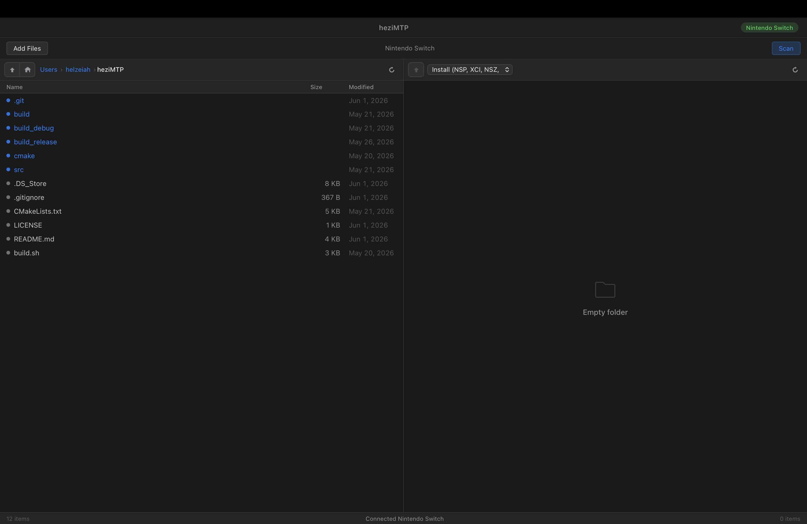

<div align="center">



<h1>heziMTP</h1>

<p>A fast (<strong>3-4x faster than direct microSD</strong>), native macOS MTP client for Nintendo Switch.<br>
Transfer NSP, XCI, and NRO files over USB-C without ever removing your microSD card.</p>

[](https://www.apple.com/macos/)
[](LICENSE)
[]()
[]()

</div>

---

## Features

- **Direct USB-C transfer** — talks to DBI or Sphaira MTP mode over USB, no SD card removal needed
- **Fast** — USB 3.0 support with adaptive chunk sizing; real-world speeds of 60–150+ MB/s depending on your Switch/cable
- **Two-panel file browser** — Mac filesystem on the left, Switch on the right; drag files between them
- **Multi-file transfer** — select multiple files with Cmd+click or Shift+click, drag them all at once
- **Large file support** — handles files >4 GB correctly
- **Automatic device detection** — plug in and go, no scanning needed
- **Modern macOS UI** — native dark mode, SF Pro font, macOS 12+ window chrome
- **No dependencies** — libusb is statically linked; nothing to install

## Requirements

- **Mac**: macOS 12 Monterey or later (universal binary — Apple Silicon + Intel)
- **Switch**: Custom firmware with [DBI](https://github.com/rashevskyv/dbi) or [Sphaira](https://github.com/ITotalJustice/sphaira) installed
- **Cable**: any cable that supports data transfer (not charge-only)

## Getting Started

### 1. Set up your Switch

In DBI: go to **Tools → MTP Responder**

In Sphaira: go to **Tools → MTP**

Plug in the USB-C cable and leave the screen open

### 2. Build from source

```bash
git clone https://github.com/helzeiah/heziMTP.git
cd heziMTP
./build.sh          # release build
./build.sh run      # build + launch
```

Or build manually:

```bash
cmake -B build -DCMAKE_BUILD_TYPE=Release
cmake --build build -j$(sysctl -n hw.logicalcpu)
open build/heziMTP.app
```

**Build dependencies** (fetched automatically by CMake):

- libusb 1.0.27
- No other external dependencies

### 3. Transfer files

- **Browse** your Mac on the left, Switch on the right
- **Drag** files from left → right to upload, right → left to download
- **Double-click** a local file to upload it directly when connected
- **Right-click** for context menu (Upload to Switch / Download to Mac / Delete)
- **Add Files** button opens a native file picker for multi-file upload

## How fast is it?


| Connection                               | Typical speed |
| ---------------------------------------- | ------------- |
| USB 2.0                                  | 25–45 MB/s    |
| USB 3.0 (Switch OLED / direct USB-C 3.x) | 60–150+ MB/s  |


Speed is limited by your microSD write speed (for uploads) and USB link speed. A fast UHS-I card + USB 3.0 cable will get the most out of it.

## Troubleshooting

**App doesn't detect my Switch**

- Make sure DBI or Sphaira is running in MTP mode (not just the home menu)
- Try a different USB-C cable — many charge-only cables have no data pins
- Click the **Scan** button in the app

**"Operation not supported" error**

- Update DBI/Sphaira to a recent version
- Sphaira specific: ensure you're in the **MTP Install** menu

## Building

```
./build.sh           # release (default)
./build.sh debug     # debug build
./build.sh run       # release + launch
./build.sh clean     # wipe build dirs
```

The build system fetches libusb from source and compiles it as a static library — no Homebrew or system dependencies required.

## Architecture

```
src/
├── main.mm               Entry point (NSApp + WKWebView)
├── ui/
│   ├── App.hpp/.mm       Backend: device monitoring, local/remote file state, transfers
│   ├── WebUI.hpp/.mm     Bridge: WKWebView setup + JS↔C++ message handler
│   └── webroot/          Frontend: HTML/CSS/JS (no build step, no frameworks)
├── mtp/
│   ├── MTPProtocol.hpp   MTP constants, container format, data structures
│   ├── MTPSession.*      USB/libusb transport layer, chunked transfers
│   └── MTPOperations.*   High-level MTP operations (GetObject, SendObject, etc.)
└── transfer/
    └── TransferEngine.*  Background transfer queue with progress tracking
```

The UI is a WKWebView-rendered HTML/CSS/JS app communicating with a C++20 MTP backend via native message passing. No Electron, no Node, no external runtime — just AppKit + WebKit + libusb.

## License

MIT — see [LICENSE](LICENSE).
